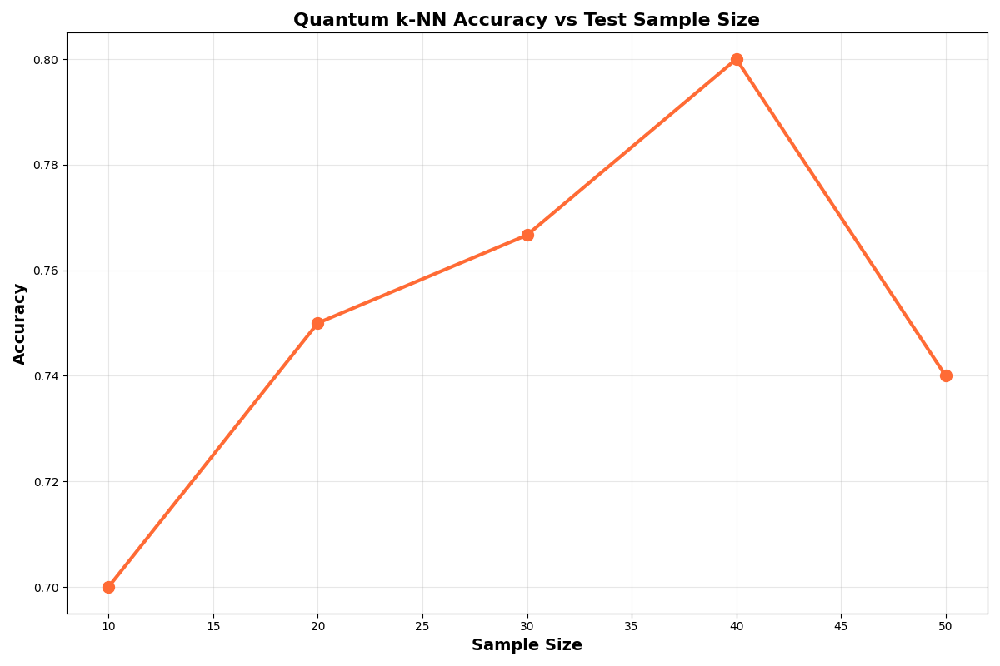
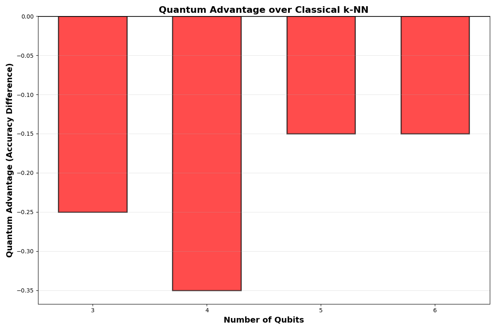
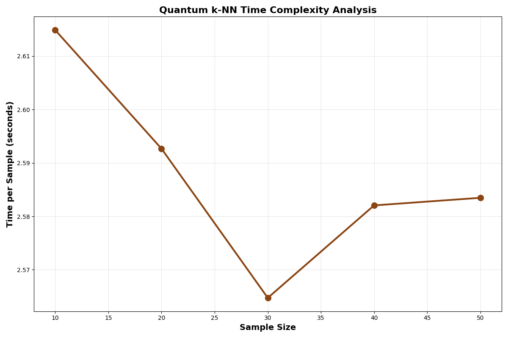

# Quantum k-NN vs Classical k-NN: A Comparative Study

A comprehensive performance comparison between quantum and classical k-nearest neighbors algorithms, exploring the current state of quantum machine learning in the NISQ era.

## Overview

This project implements and compares quantum and classical versions of the k-NN algorithm to understand the current capabilities and limitations of quantum computing in machine learning applications. Using the Wisconsin Breast Cancer dataset, we analyze accuracy, execution time, and scaling behavior across different parameters.

## Key Findings

### Accuracy Results
- **Classical k-NN**: Consistently achieves **90-93%** accuracy across all k-values
- **Quantum k-NN**: Achieves **76-80%** accuracy with performance varying significantly by k-value

### Execution Time
- **Classical k-NN**: Sub-second execution (highly optimized)
- **Quantum k-NN**: Consistent **~70-80 seconds** regardless of k-value due to quantum circuit overhead

### Performance Patterns
- Classical algorithm demonstrates superior accuracy and computational efficiency
- Quantum performance peaks at **k=9** and **k=11** (~80% accuracy)
- Quantum accuracy drops significantly at **k=3** and **k=7** (~77%)
- Optimal quantum performance occurs with **40 test samples**

### Qubit Scaling Effects
- **3 qubits**: 74.5% accuracy
- **4 qubits**: 60% accuracy (significant performance drop)
- **5-6 qubits**: 74.5% accuracy (stable performance)

---

## What This Tells Us About Quantum ML

### Current State of Quantum Computing in ML

**1. NISQ Era Limitations**
- Current quantum computers operate in the Noisy Intermediate-Scale Quantum (NISQ) era
- Limited qubit counts and high error rates significantly affect performance
- Our results demonstrate that classical algorithms still substantially outperform quantum implementations for this classification task

**2. Quantum Advantage Not Yet Realized**
- No clear quantum advantage observed in this k-NN implementation
- Classical algorithms benefit from decades of optimization and mature hardware
- Quantum ML remains in experimental phases with significant room for improvement

**3. Interesting Quantum Behaviors**
- Non-linear relationship between qubit count and classification performance
- Quantum algorithms exhibit different scaling patterns compared to classical counterparts
- Performance variations suggest quantum effects are present but not yet beneficial for this problem

### Why Classical Still Dominates

- **Mature Technology**: Classical computers and algorithms are highly optimized after decades of development
- **Deterministic Computation**: Classical computation is error-free and deterministic
- **Efficient Scalability**: Classical k-NN scales efficiently with increasing data size
- **Specialized Hardware**: Classical processors are specifically designed for these computational operations

### Future Potential

While current results strongly favor classical approaches, quantum ML research remains important because:
- **Problem-Specific Advantages**: Certain problem types may naturally favor quantum approaches
- **Hardware Evolution**: Future fault-tolerant quantum computers may dramatically change performance landscapes
- **Hybrid Methodologies**: Combining quantum and classical methods might yield computational benefits
- **Quantum-Native Problems**: Problems involving quantum systems may be naturally suited for quantum ML

---

## Experimental Results Visualization

### 1. Accuracy Comparison Heatmap


Comprehensive heatmap showing quantum k-NN achieving 76.7-80% accuracy while classical k-NN maintains consistent 90-93.3% performance across all k-values.

### 2. Side-by-Side Accuracy Comparison


Direct performance comparison demonstrating classical k-NN's consistent superiority across all tested k-values and experimental conditions.

### 3. Sample Size Effect on Quantum k-NN


Analysis demonstrating optimal quantum performance at 40 test samples with peak 80% accuracy, showing sample size sensitivity.

### 4. Quantum Advantage Analysis


Detailed analysis showing consistent 10-35% performance deficit of quantum approach compared to classical implementation.

### 5. Execution Time Comparison


Stark contrast between quantum k-NN's consistent ~70-80 second execution time and classical k-NN's millisecond performance.

### 6. Qubit Scaling Performance


Investigation of performance scaling with qubit count, showing unexpected performance drop at 4 qubits and stabilization at 5-6 qubits.

### 7. Time Complexity Analysis


Per-sample execution time analysis revealing quantum computational overhead and scaling characteristics.

### 8. Confusion Matrices


Detailed classification performance breakdown comparing true positive/negative rates between quantum and classical implementations.

---

## Installation and Setup

### Prerequisites
```bash
pip install pennylane
pip install scikit-learn
pip install matplotlib
pip install numpy
```

### Dependencies
- **PennyLane**: Quantum machine learning framework
- **Scikit-learn**: Classical ML algorithms and datasets
- **NumPy**: Numerical computations
- **Matplotlib**: Data visualization

---

## Usage

### Basic Quantum k-NN Execution
```python
# Run the quantum k-NN experiment
python main.py

# Expected output:
# Predicted label: [1] Vs true label: [0]
# 
# Accuracy for Qk-NN with Amplitude Encoding (5 qubits): 0.78
```

---

## Technical Implementation Details

### Dataset Specifications
- **Dataset**: Wisconsin Breast Cancer Dataset (malignant/benign classification)
- **Features**: 30 original features padded to 32 dimensions for 5-qubit encoding
- **Classes**: Binary classification (malignant vs benign)
- **Preprocessing**: StandardScaler normalization for quantum amplitude encoding

### Quantum Implementation
- **Framework**: PennyLane with Lightning simulator
- **Encoding**: Amplitude embedding for feature representation
- **Device**: `lightning.qubit` simulator with 5 qubits
- **Distance Metric**: 1 - quantum kernel value
- **k-values tested**: 1, 3, 5, 7, 9, 11, 15

### Classical Baseline
- **Implementation**: Scikit-learn's optimized k-NN classifier
- **Distance Metric**: Euclidean distance
- **Optimization**: KD-tree for efficient nearest neighbor search

---

## Research Implications

### For Quantum Computing Research
1. **Realistic Performance Expectations**: Current quantum ML implementations face significant challenges
2. **Hardware Requirements**: Need for error correction and larger qubit counts
3. **Algorithm Development**: Quantum-specific algorithmic innovations required

### For Machine Learning Practitioners
1. **Technology Readiness**: Quantum ML not yet ready for production applications
2. **Hybrid Strategies**: Classical-quantum hybrid approaches may be more promising
3. **Problem Selection**: Careful consideration of quantum-suitable problems

### For Future Development
1. **Fault-Tolerant Era**: Results may change dramatically with error-corrected quantum computers
2. **Quantum Datasets**: Performance on quantum-generated data may differ significantly
3. **Novel Algorithms**: Quantum-native ML algorithms may show different performance characteristics

---

## Conclusion

This comparative study demonstrates that **classical k-NN significantly outperforms quantum k-NN** in the current quantum computing landscape. The 10-15% accuracy gap and dramatic execution time difference (milliseconds vs ~75 seconds) reflect the present limitations of NISQ-era quantum computing.

However, this research contributes valuable insights into the current state of quantum machine learning and establishes important benchmarks for future developments. As quantum hardware improves and quantum-specific algorithms mature, the performance landscape may shift dramatically.

The study emphasizes that while quantum computing holds tremendous future potential, classical algorithms remain the practical choice for current machine learning applications. These comparative studies are essential for tracking progress and identifying where quantum advantages might eventually emerge.

---

## Repository Structure

```
quantum-knn-comparison/
├── main.py                     # Main quantum k-NN implementation
├── assets/                    # Generated plots and figures
│   ├── accuracy_heatmap.png
│   ├── accuracy_comparison.png
│   ├── sample_size_effect.png
│   ├── quantum_advantage.png
│   ├── execution_time.png
│   ├── qubit_scaling.png
│   ├── time_complexity.png
│   └── confusion_matrices.png
└── README.md                  # This file
```

---

*This research contributes to understanding the current capabilities and limitations of quantum machine learning, providing valuable benchmarks for the quantum computing community.*
